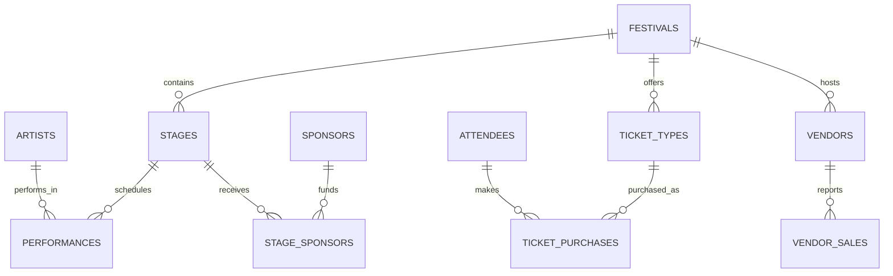

# SummerTides data dictionary

| Table | Purpose | Primary key | Important relationships |
|---|---|---|---|
| festivals | One festival edition and its dates/location. | festival_id | Has stages, ticket types, and vendors. |
| stages | Performance or exhibition areas. | stage_id | Belongs to a festival; has performances and sponsors. |
| artists | Booked musicians and DJs. | artist_id | Has scheduled performances. |
| performances | Artist timetable entries. | performance_id | Links one artist to one stage. |
| attendees | Festival customers. | attendee_id | Has ticket purchases. |
| ticket_types | Ticket products and prices. | ticket_type_id | Belongs to a festival; is used in purchases. |
| ticket_purchases | Tickets bought by attendees. | purchase_id | Links attendees and ticket types. |
| vendors | Festival traders. | vendor_id | Belongs to a festival; has daily sales. |
| vendor_sales | Daily vendor sales reports. | vendor_sale_id | Belongs to a vendor. |
| sponsors | Funding organizations. | sponsor_id | Funds stages through stage_sponsors. |
| stage_sponsors | Sponsor allocation to a stage. | stage_sponsor_id | Links stages and sponsors. |

## Key business rules

- Festival end dates cannot precede start dates.
- A stage name is unique within a festival, and a ticket name is unique within a festival.
- Attendee emails, sponsor names, and vendor daily sales records are unique.
- Stage capacity is positive; ticket quantities are positive; financial values cannot be negative.
- A performance must end after it starts.

## ER diagram

